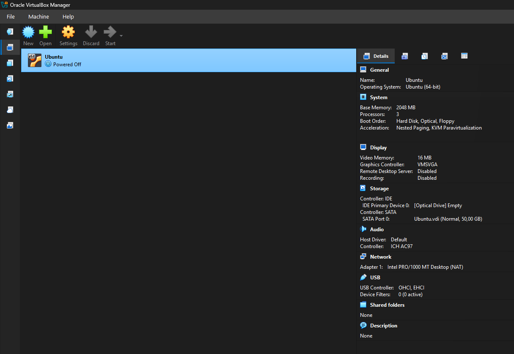
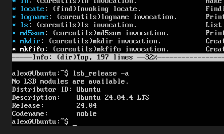
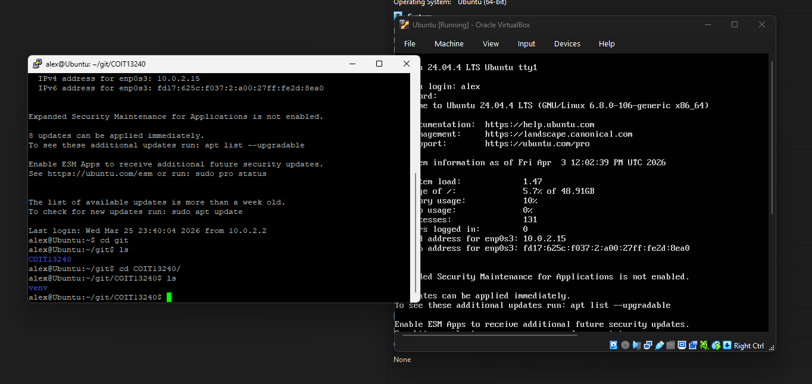

# COIT13240 Journal - Week 01

# 1. Tutorial Activities

## 1.1 Installing Ubuntu Linux on a Virtual Machine (VirtualBox)
To start off the tutorial activity I downloaded Virtual Box and Ubuntu Linux (Server) version 24.04.4 LTS. This can be seen on the screenshots below.

## 1.2 Using PuTTY to connect the virtual machine to GitHub.
After installing everything I used PuTTY to easily connect the virtual machine to GitHub, as you can't copy and paste easily through VirtualBox, but you can using PuTTY. For this I used an SSH key through GitHub. This can be seen in the screenshots below.

I also installed and used picypher on the virtual machine. I did this by using pip install pycipher.

# 2. Reflection

## 2.1 What did I learn
This week I had some practice in installing a virtual machine and I learnt how to set up a new virtual machine through VirtualBox as I usually used vCenter or VMware Workstation Pro. This is a nice skill to add to my portfolio.

## 2.2 Issues and Solutions
I ran into issues whilst trying to install this specific Ubuntu Linux version on VMware Workstation Pro, as I was planning on using that at first. I did some online research and found out that multiple users were running into this issue and it was caused by VMware and it not supporting the latest version(s) of Ubuntu Linux LTS.

I solved this issue by simply downloading VirtualBox which did not only solve the problem, but also gave me experience with different software.

## 2.3 How did I improve
I improved by getting extra experience with other software and by getting some more practice in setting up local virtual machines, using a combination with PuTTY and connecting it to GitHub.
