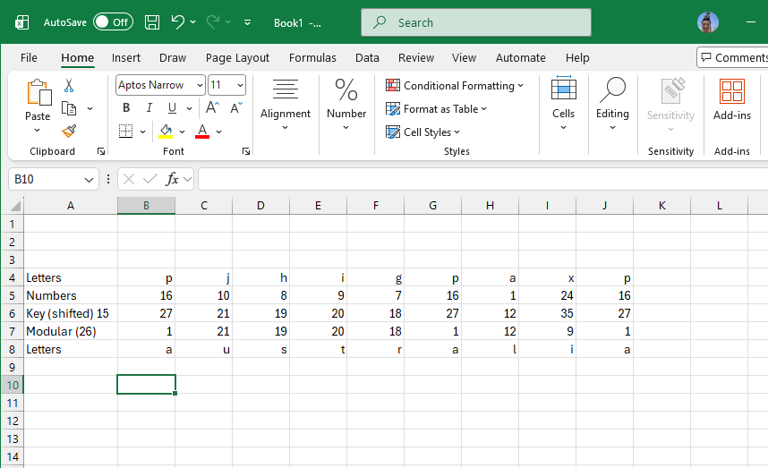
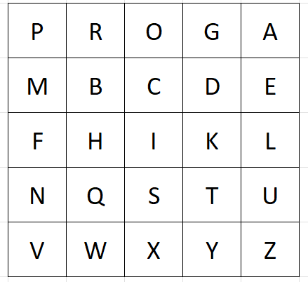
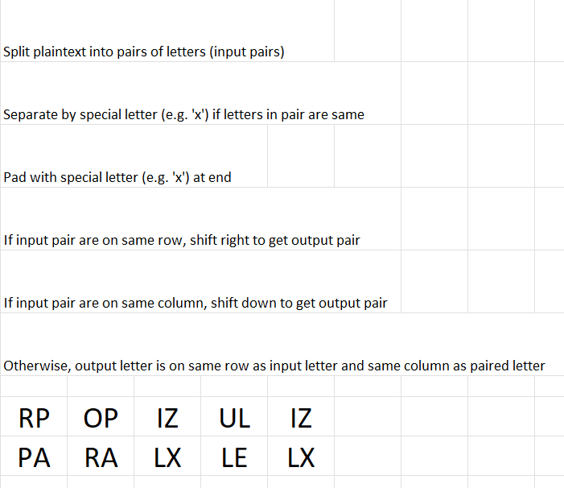
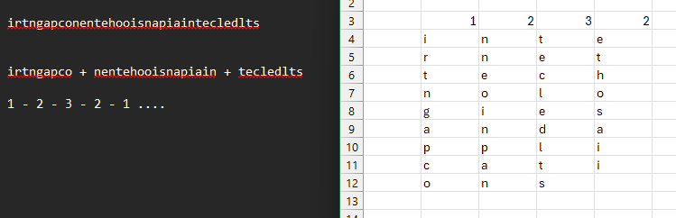
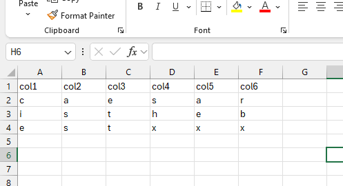

# COIT13240 Journal - Week 02

# 1. Tutorial Activities

## 1.1 Manual Caesar Decrypt
For this assignment, the encrypted text equals: pjhigpaxp. We are also given the key, which is 15. This means every letter is shifted +15.
To retrieve the plaintext, I can either shift everything back 15, or I can shift it forward 11. (The alphabet is 26 letters total). In this case I chose to shift it forward 11 and then use modular 26 to get the respective letters.

This results in pjhigpaxp = australia.

## 1.2 Caesar decrypt without key

For this assignment, I used pycipher and manually went through the options to get the correct key and the correct plaintext. I did this using pycipher.decipher. This can be seen in the screenshot below.

The encrypted text is knuprdv. Using the pycipher decipher leads to key 9 and the plaintext word was Belgium.

## 1.3 Playfair decrypt

For the playfair decrypt, the keyword was program. After inserting that into a table I had a way to decrypt the word 'rpopizuliz'. The next task was to split the encrypted word into pairs, this gives RP OP IZ UL IZ. Using the Playfair rules (same row -> shift left, same column -> shift up, rectangle rule -> same row swap columns) I landed on the word PA RA LX LE LX. X has to be removed, giving PARALLEL.

Screenshots of the process using the provided excel document can be seen below.

## 1.4 Rail Fence Decrypt

This encryption had key 3. Meaning it is split up into 3 rails and it goes from 1 to 2 to 3 to 2 to 1. If looking at how many times a letter passes through each rail it would be 1:2:1. So I split the encryption up into three rails first, this results in:

irtngapco + nentehooisnapiain + tecledlts

If I then put this into excel, this results into the following word:

internettechnologiesandapplications

(internet technologies and applications)

The process can be seen below in the screenshot attached:

## 1.5 Row / Column decrypt

For this decryption I split up the ciphertexts so I would have my columns. 

This reults in:

Col 1 cie
Col 2 rbx
Col 3 shx
Col 4 ett
Col 5 ass
Col 6 aex

With the key digit 1 6 4 3 2 5.

This translates into

Col 1 cie
Col 2 ass
Col 3 ett
Col 4 shx
Col 5 aex
Col 6 rbx

The final word is Caesar is the best (skip x).

The picture below shows the excel process.

# 2. Reflection

## 2.1 What did I learn
During this week, I learnt a lot of new ciphers, how they operate and what rules they use and most importantly how to encypher and decypher plaintexts or cypher texts using these ciphers. Besides manual deciphering, I also got experience using python deciphering.

## 2.2 Issues and Solutions
I ran into some issues deciphering some texts, but these were quickly resolved after rewatching the lecture slides or doing some simple google searches. All ciphers are relatively easy to solve once you know the rules and calmly write the ciphers out into an excel file or on some paper.
