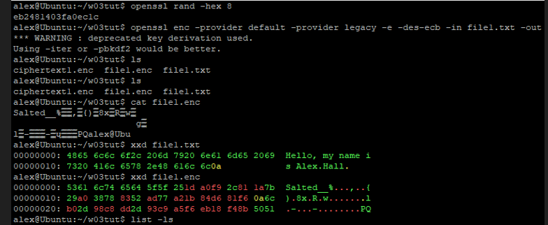
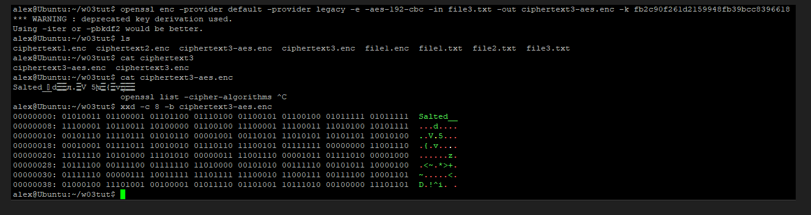

# COIT13240 Journal - Week 03

# 1. Tutorial Activities

## 1.1 Information Known by Attacker
The difference between a KPA, CPA and CCA are quite simple. 

Known Plaintext Attack:
- Attacker knows the plaintext and has the ciphertext that belongs to it
- The attacker does not know the key
- The goal is to recover the key (possibly to decrypt other messages using the same key)

Chosen Plaintext Attack:
- Attacker can choose a plaintext and can encrypt them
- Attacker knows the plaintext and the ciphertext that belongs to it
- The goal is to recover the key as well

Chosen Ciphertext Attack:
- Attacker can choose ciphertexts and get them decrypted
- Attacker knows the chosen ciphertext and the resulting plaintext

## 1.2 Modes of operation
Modes of operation such as CBC links blocks together (chaining).

This allows for encrypting long data and adds extra security such as forementioned chaining.

## 1.3 Attack on AES-128
For this question I made use of GenAI.

AES-128 key space = 2¹²⁸ ≈ 3.4 × 10³⁸
Attack is 1,000,000× faster → effective space:
2¹²⁸ / 10⁶ ≈ 3.4 × 10³²

Assume:

$10M hardware ≈ ~10¹² keys/sec (optimistic)

Time ≈
3.4 × 10³² / 10¹² = 3.4 × 10²⁰ seconds

Convert:
≈ 10¹³ years

As was already known and expected, even with computer equipment of $10,000,000 it is still completely unfeasible to brute force AES-128. Unless you have a quantum computer, which will cost way more than $10 million.

## 1.4 DES in OpenSSL

This assignment can be seen executed in the following screenshots:

In the screenshots I created a text file and encrypted it using DES with OpenSSL. I also used xxd to show the ciphertext and plaintext file.

## 1.5 AES in OpenSSL
The creation of the file using AES and OpenSSL can be seen in the screenshot below. The lenght of they key is quite a bit bigger than the one from DES.

# 2. Reflection

## 2.1 What did I learn
This week I learnt more about different attacks to retrieve the key when using ciphertexts such as KPA, CPA and CCA.
Besides that I also learnt about modes of operation and why they are necessary. 

I also discovered the differences in security between older encryptions such as DES or standard, new ones, such as AES-128. 

I also learnt that it is unfeasible to brute force AES-128 with current technologies (available to the public of course).

## 2.2 Issues and Solutions
I did not really have issues during this week. Any small issues I did run in, I quickly solved by just searching it up in the content provided on Moodle. 