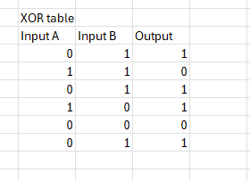

# COIT13240 Journal - Week 04

# 1. Tutorial Activities

## 1.1 Exclusive OR

For this assignment I had to calculate the exclusive OR of 010100 and 111001.
The results can be seen in a table in the picture below.

## 1.2 Simple block cipher

For the encryption in this assignment I chose a random 5-bit plaintext of 00101 and a secret key of 101. The ciphertext that you get from this is 00011.

For the decryption in this assignment I had to use the following ciphertext: 11111 and a random 3-bit key.
Using 110 as key, this results in the plaintext being 01110.

## 1.3 SBC in CBC Mode

For the A value I chose 10101. For B I chose 01010.
The constructed plaintext results in (ABA) 101010101010101.
For K1 I chose 011 and for IV1 I chose 00111.

XOR with the first plaintext block and IV1 equals
10101
00111
-----
10010

If you look this (P10010,K011) up in the table it results in the following ciphertext C1: 01101

XOR with the second plaintext block and C1 equals
01010
01101
-----
00111

If you look this (P00111,k011) up in the table it results in the following ciphertext C2: 00110

For the third plaintext block and C2 it equals the following:
10101
00110
-----
10011

Using this (P10011,K011), it results in the ciphertext C3: 11100

Now if you concatenate all ciphertext blocks it results into C1:
01101 + 00110 + 11100 = 011010011011100

## 1.4 SBC in CTR Mode

For this assignment I will use the same values, but in CTR mode.
P = 10101 01010 10101. So:
P1 = 10101
P2 = 01010
P3 = 10101

K1 = 011

IV1 = 00111
IV2 = 01000
IV3 = 01001

C1 = P1 XOR E1

in which E1 = E(K,IV1)
E1 = 00110

C1 = 

10101
00110
-----
10011

C2 = 01010 XOR E2
E2 = 01111

C2 =

01010
01111
-----
00101

C3 = 10101 XOR E3
E3 = 10001

C3 =

10101
10001
-----
00100

So cyphertext C2 = 100110010100100 (after concatenation).

## 1.5 Compare modes of operation

ECB mode encrypts plaintext blocks independently. Identical plaintext blocks therefore result in identical ciphertext blocks. It is simple and fast however.

CBC uses XOR plaintext with the previous ciphertext before encryption. This hides plaintext patterns.

The CTR mode encrypts an IV and then counts that up for all the next plaintext blocks. This is fast and turns it into a stream cipher.

CTR is faster than CBC because you can encrypt in parallel and a system does not rely on the previous cipher block.

# 2.1 What did I learn

This week I learnt more about the different block cipher modes of operation and how encryption changes depending on the mode that is used. I learnt how CBC mode chains the ciphertext blocks together by using XOR operations, while CTR mode encrypts counters and works more like a stream cipher. I also got a better understanding of why ECB mode is considered insecure, because identical plaintext blocks result in the same ciphertext blocks.

## 2.2 Issues and Solutions

One of the main issues I had this week was understanding how CBC and CTR mode actually worked step-by-step. At first I was a bit confused on how the XOR calculations connected with the SBC lookup table and why the ciphertext blocks changed based on previous values. I solved this by manually writing out every XOR operation and going through the encryption process block-by-block until it started making more sense.

I also had some confusion with CTR mode regarding the IV and the counters. After redoing the calculations a few times I understood that CTR mode first encrypts the IV and incremented counters, and then XORs those encrypted values with the plaintext blocks.

## 2.3 How did I improve

I improved my understanding of symmetric encryption modes and became more comfortable doing manual cryptographic calculations. I also improved at breaking encryption algorithms down into smaller steps, which made it easier to understand how CBC and CTR mode internally work. This gave me a better understanding of how modern encryption systems use different modes depending on the performance and security requirements.

